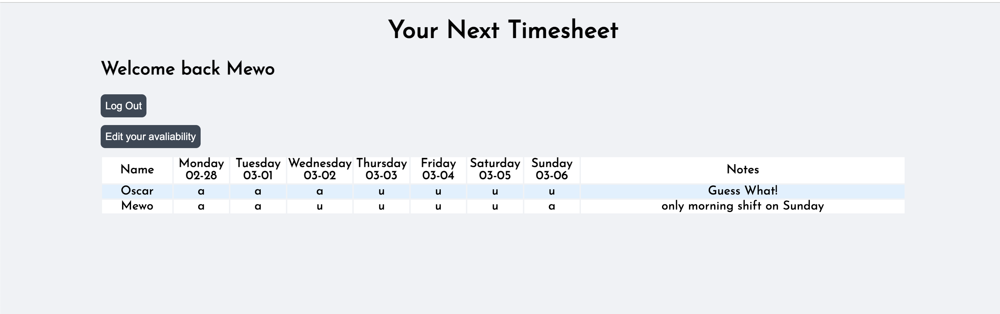

Use the most powerful tool to manage your team's timesheet.
Try the app on Heroku(app)[https://stella-timesheet.herokuapp.com/]

1. If you are a manager:
   -- Sign up and choose 'y' to create a manager ID.
   -- Tell your members your manager ID so your team members can submit their timesheets by entering the manager ID.
   -- After submitting yoursleves timesheet, you will be able to see the whole timesheet of your team.

2. If you are a team member:
   -- Sign up, enter your manager ID that your manager send you when filling your timesheet.
   -- After submitting your timesheet, you will be able to see the whole timesheet of your team.
   -- And also you can edit your timesheet anytime.
